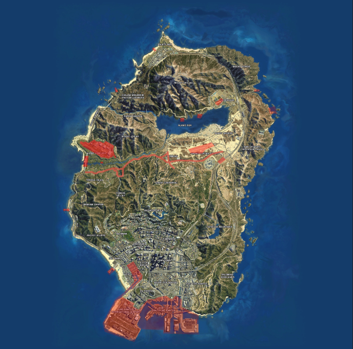

# **Wetboek Veendorp**

|  |   |
| ------------ | ------------- | 
| Overheidsorganisatie | Hoge Raad Veendorp| 
| Citeertitel  | Wetboek Veendorp Roleplay  |   
| Vastgesteld door | Hoge Raad & Politie Veendorp | 
| Onderwerp | Openbare Orde & Veiligheid | 

## **Artikel 1 - Reikwijdte**

1. Het Wetboek Veendorp Roleplay (verder aangeduid als WBR) is leidend voor alle beschreven gevallen, waarbij als aanvulling het Nederlands Recht van toepassing is. 

2. Het WBR heeft betrekking op het vaste land en eiland van Veendorp Roleplay 

## **Artikel 2 – Strafbepaling** 

1. Straffen zijn vastgesteld en opgenomen per artikel.  
   Hieronder vallen;
    
*a. Waarschuwingen.  
b. Taakstraffen. (in uren)  
c. Celstraffen. (in maanden)  
d. Rijontzeggingen. (in uren)  
e. Inbeslagnames of invorderingen.  
f. Boetes.*

2. Een opgelegde straf kan een combinatie zijn van de bovenstaande strafvormen. 
 
3. Een opgelegde straf is nooit hoger dan de vastgestelde waarden.  
 
4. Een straf kan wel verhoogd worden door het stapelen van overtredingen.  
 
5. Een straf kan ook verlaagd worden door verzachtende omstandigheden.  
 
6. Een straf kan geheel of gedeeltelijk kwijtgescholden worden op basis van uitsluitingsgronden. 
 
7. Poging tot word verlaagd met 33%.

## **Artikel 3 - Geldigheid**

1. Bij verandering van een wetgeving na het tijdstip waarop het feit begaan is, wordt voor de verdachte de meest gunstigste bepalingen toegepast. 
 
2. Het is voor een staff-lid niet toegestaan om mee te beslissen over een zaak die over hunzelf, vrienden en/of familie gaat. Dit om te versterken dat een zaak op een eerlijke en rechtvaardige manier behandeld wordt. 
 
3. Minderjarigen worden binnen Veendorp Roleplay, op dezelfde manier behandeld als volwassenen. Alle bepalingen, straffen en dergelijke zijn ook van toepassing op hen. Minderjarigen hebben dezelfde rechten en plichten als volwassenen. Het jeugdstrafrecht is in Veendorp Roleplay niet van toepassing. 

## **Artikel 4 - Strafblad** 

1. Straffen die enige vorm van celstraf bevatten kunnen leiden tot een strafblad.  
 
2. Een strafblad blijft staan voor een periode van 1 (realtime) maand voor alle geweldsdelicten met celstraf, en 14 dagen voor alle overige delicten met celstraf, ingaand op de datum van de opgelegde straf. 

## **Artikel 5 - Verduidelijking en algemene aanvulling**

1. Onder goederen kan worden verstaan alles wat tussen twee personen kan worden uitgewisseld.

*a. Hieronder valt, onder andere, alles wat in de inventaris gevonden kan worden, alsmede voertuigen* 
 
2. Onderzoek, tenzij expliciet anders aangegeven, duurt in de regel maximaal twee (2) dagen. 

*a. Als na deze termijn geen conclusie is getrokken of getrokken kan worden, is de Overheid verplicht tot het retourneren van de onderzochte goederen.* 
 
3. Zij, die in dienst van de Overheid, genoodzaakt zijn een actie uit te voeren welke volgens de wet verboden is, kunnen vanwege het noodzakelijk aspect, binnen de contouren van hun functie, niet aangeklaagd worden als zijnde in overtreding van de wet. 

*a. Bovenstaande ontslaat ambtenaren in dienst van de Overheid niet van alle overige rechtsvervolging.*
 
4. Strafbare feiten zijn overtredingen en misdrijven. Hieronder vallen ook misdrijven en overtredingen uit het Wetboek van Strafrecht van Nederland. 

## **Artikel 6 - Inbeslagname**

1. Wanneer een strafbaar feit gepleegd is met een goed, of wanneer een goed uit een strafbaar feit is verkregen, kan deze in beslag worden genomen.  
De keuze voor inbeslagname is ter beoordeling van de politie.  
Verwerking van de in beslag genomen goederen geschiedt volgens richtlijn van de politie.  
 
2. Wanneer een voertuig in beslag wordt genomen vanwege een strafbaar feit:  
*a. Kan deze maximaal drie (3) dagen worden vastgehouden voor onderzoek.*  
*b. Zal deze, nadat bewijsbaar is aangetoond dat het voertuig onderdeel was van een strafbaar feit waarbij de eigenaar ook veroordeeld is, uitgekocht kunnen worden voor 25% van de nieuw waarde bij verkeersovertredingen & 33% bij criminele activiteiten.*
 
*c. Zal deze kosteloos worden teruggegeven (na eventueel onderzoek) indien de eigenaar geen strafbaar feit ten laste is gelegd, of kan gelegd worden, welke in directe zin gekoppeld is aan de reden van inbeslagname.*  
 
3. Geldige redenen voor inbeslagname zijn:  
*a. Plegen van een strafbaar feit uit het wetboek van stadsleven waarbij het goed direct of indirect betrokken is, behalve fout parkeren en een snelheidsovertreding.*  
*b. Niet stoppen voor stopteken gegeven door middel van een politie transparant of rode lamp.*  
*c. Niet voldoen aan (verkeers)aanwijzing van bevoegde en als zodanig kenbare opsporingsambtenaar.*  
*d. Snelheidsovertreding van meer dan 100% van de maximumsnelheid*

4. Voertuig dient binnen 2 weken na inbeslagname worden afgehaald, anders zal deze in de politieveilingen worden verkocht.

5. Een voertuig dat in beslag is genomen kan pas na 24 uur worden opgehaald bij het politiebureau.

## **Artikel 7 - Openstaande boetes**

1. Wanneer tijdens een controle of aanhouding aangetoond wordt dat het totaalbedrag van openstaande boetes boven de €5.000,- reikt, kan dit impact hebben op de strafeis. 

*a. Wanneer dit aangetoond wordt bij het opvragen van een inbeslaggenomen goed of voertuig kan geëist worden eerst het boetebedrag te voldoen.*  
*b. Wanneer dit aangetoond wordt tijdens onderzoek volgende op een misdrijf of crimineel feit kan hiervoor een boete of taakstraf worden opgelegd.*
  
*c. De hoogte van deze boete of taakstraf is ter beoordeling van de Officier van Dienst.*
 
*d. Deze boete of taakstraf wordt bijgevoegd bij de totale strafeis.*
  
 
2. Onder het voldoen van het boetebedrag wordt verstaan tenminste een zodanige betaling te voldoen dat het totale boetebedrag onder de € 2.000,- komt. 

## **Artikel 8 – Consultatierecht**

1. Krachtens artikel 6 van het Europees Verdrag voor de Rechten van de Mens is het een verdachte, voorafgaand aan een politieverhoor, toegestaan consultatie te ontvangen van zijn of haar voorkeursadvocaat.  
 
2. Indien de voorkeursadvocaat genoemd in lid 1 niet beschikbaar is, is een vervangend advocaat afdoende om te voldoen aan dit recht.  
 
3. Indien de verdachte verkiest zelf een voorkeursadvocaat op te roepen zijn de kosten van consultatie en rechtsbijstand voor rekening van de verdachte;  
 
4. Indien de oproep zoals genoemd in lid 3 niet mogelijk blijkt, of de verdachte weigert een advocaat op te roepen, dan is de politie verplicht tot het oproepen van een advocaat voor de verdachte;  
 
5. Uitsluitingsgrond voor lid 4 is wanneer verdachte expliciet en ondubbelzinnig afziet van zijn of haar recht tot consultatie 

## **Artikel 9 - Algemene Rechtsbeginsel** 

1. De algemene rechtsbeginselen stellen eisen en scheppen kaders aan beleid of regelgeving. Beleid of regelgeving dat onvoldoende aansluit op algemene rechtsbeginselen kan onderhevig zijn aan uitsluiting of verwerping. 
 
2. Onder de algemene rechtsbeginselen wordt verstaan: 

*a. Subsidiariteit, het toepassen van maatregelen en acties die het minst bezwarend zijn;*

*b. Proportionaliteit, het in verhouding hebben en houden van acties, sancties en beslissingen ten opzichte van het (mogelijk) gepleegde feit;*

*c. Behoorlijk Bestuur, gebaseerd op de beginselen van vertrouwen, rechtszekerheid, gelijkheid en onpartijdigheid;*

*d. Legaliteit, waarbij het overheidsoptreden dat ingrijpt op de rechten en plichten  (persoonlijke levenssfeer) van burgers moet berusten op een wettelijke grondslag;* 

*e. Kenbaarheid van regelgeving, waarbij burgers in staat gesteld moeten zijn kennis te nemen van regelgeving;* 

*f. Redelijkheid en billijkheid, waarbij als factor de redelijkheid en rechtmatigheid als ongeschreven regel dient te gelden bij overeenkomsten en situaties;* 

*g. Hoor en wederhoor, waarbij alle partijen recht hebben om hun zegje te doen;* 

*h. Onschuldpresumptie, waarbij een verdachte onschuldig is tot het tegendeel bewezen is;*

*i. Détournement de pouvoir, waarbij de wet alleen mag toegepast worden waar deze voor bedoeld is;* 

*j. bis in idem, waarbij iemand niet tweemaal veroordeeld mag worden voor hetzelfde feit;* 

*k. Het schutznorm-beginsel, waarbij er geen rechtsgevolg of sanctie wordt gekoppeld aan een vormfout als de verdachte niet zelf is getroffen in een (verdedigings)belang dat door het geschonden vormvoorschrift wordt beschermd.*

## **Artikel 10 – Medepleging en medeplegen** 

1. Als medeplichtigen van een strafbaar feit worden gestraft: 

*a. zij die opzettelijk behulpzaam zijn bij het plegen van het misdrijf;*
 
*b. zij die opzettelijk gelegenheid, middelen of inlichtingen verschaffen tot het plegen van het misdrijf;* 

*c. zij die opzettelijk het misdrijf bevorderen of makkelijker maken.* 
 
2. Er is sprake van medeplichtigheid als de verdachte behulpzaam is geweest bij het plegen van het strafbare feit van een ander persoon. Bij medeplichtigheid is de rol van de medeplichtige duidelijk kleiner dan de rol van de hoofdverdachte. 
 
3. Bij medeplichtigheid aan een strafbaar feit wordt de straf met 33% verminderd. 
 
4. Als daders van een strafbaar feit worden gestraft: 
 
5. Zij die het feit plegen, doen plegen of medeplegen; 
 
6. Zij die door giften, beloften, misbruik van gezag, geweld, bedreiging, of misleiding of door het verschaffen van gelegenheid, middelen of inlichtingen het feit opzettelijk uitlokken. 
 
7. Er is sprake van medeplegen indien twee of meer personen gezamenlijk een strafbaar feit plegen, waarbij er sprake is van een bewuste en nauwe samenwerking. Het draait hierbij voornamelijk om een samenwerking. 
 
8. Daders en medeplichtigen van een strafbaar feit worden gestraft volgens de strafbepaling van het desbetreffende artikel. 
 
9. Indien er onduidelijkheid is over medeplegen of medeplichtigheid tijdens een strafzaak dan kan een Hulpofficier van Justitie, Officier van Justitie of in uiterste gevallen een rechter hierover een eindoordeel vellen. 

## **Artikel I-1 – Diefstal (SR310 / SR311)**

1. Schuldig is een persoon die een goed, of voertuig, wegneemt zonder daarvoor toestemming of enig recht toe te hebben.

2. Bij feiten hieronder vermeld worden verzwarende omstandigheden in rekening gebracht met de daarbij horende strafmaat. in dit geval zal de straf die geëist wordt vermeerderd worden met 1/3:  
 
3. Wanneer een diefstal gedurende voor de nachtrust bestemde tijd, in een woning of op een besloten erf waarop een woning staat, door iemand die aldaar buiten weten of tegen de wil van de rechthebbende bevindt. en/of;  
 
4. Wanneer diefstal die door twee of meerdere verenigde personen. en/of;  
 
5. Wanneer diefstal waarbij de schuldige zich de toegang tot de plaats van het misdrijf heeft verschaft of het weg te nemen goed onder zijn bereik heeft gebracht door middel van braak, verbreking of inklimming, van valse sleutels, van een valse order of een vals kostuum 

| Aantal veroordelingen | Celstraf  | Taakstraf  | Boete |
| ------------ | ------------- | ------------ | ------------ |
| Eerste veroordeling  |             | 20 uur  | € 1500,00 |
| Tweede veroordeling  | 15 maanden  |         | € 3000,00  |
| Meerdere veroordeling | 30 maanden |         | € 7500,00 |

## **Artikel I-2 – Diefstal met geweld / overval (SR312)** 

1. Schuldig is een persoon die een goed wegneemt zonder daarvoor toestemming of enig recht toe te hebben, daarbij gebruik makende van geweld in enige vorm.  
 
2. Genoemd geweld is gebruikt bij de voorbereiding, diefstal of overval, of vlucht.
 

| Aantal veroordelingen | Celstraf  | Taakstraf  | Boete |
| ------------ | ------------- | ------------ | ------------ |
| Eerste veroordeling  | 20 maanden |  | € 1500,00  |
| Tweede veroordeling  | 35 maanden   | | € 1750,00  |
| Meerdere veroordeling | 45 maanden  | | € 3500,00 |

## **Artikel I-3 – Afpersing (SR317)** 

1. Schuldig is een persoon die met dwang gegevens of goederen opeist van een derde.  
 
2. Schuldig is een persoon die met dwang een actie forceert of eist van een derde. 

| Aantal veroordelingen | Celstraf  | Taakstraf  | Boete |
| ------------ | ------------- | ------------ | ------------ |
| Eerste veroordeling  | 20 maanden |  | € 1500,00  |
| Tweede veroordeling  | 35 maanden   | | € 1750,00  |
| Meerdere veroordeling | 45 maanden  | | € 3500,00 |

## **Artikel I-4 – Verduistering (SR321)** 

1.  Schuldig is een persoon die geld of goederen, die niet middels een misdrijf verkregen zijn, maar wel toebehoren aan een ander, opzettelijk en wederrechtelijk toe-eigent. 

| Aantal veroordelingen | Celstraf  | Taakstraf  | Boete |
| ------------ | ------------- | ------------ | ------------ |
| Eerste veroordeling  | 10 maanden |  | € 750,00  |
| Tweede veroordeling  | 20 maanden   | | € 1250,00  |
| Meerdere veroordeling | 30 maanden  | | € 3000,00 |

## **Artikel I-5 – Afdreiging / chantage (SR318)** 

1. Schuldig is een persoon die gegevens of goederen opeist van een derde door bedreiging met smaad of openbaring van een geheim.  
 
2. Schuldig is een persoon die een actie forceert of eist van een derde door bedreiging met smaad of openbaring van een geheim. 

| Aantal veroordelingen | Celstraf  | Taakstraf  | Boete |
| ------------ | ------------- | ------------ | ------------ |
| Eerste veroordeling  | 30 maanden |  | € 5000,00  |
| Tweede veroordeling  | 45 maanden   | | € 7500,00  |
| Meerdere veroordeling | 60 maanden  | | € 10.000,00 |

## **Artikel I-6 - Heling (SR416)** 

1. Schuldig is een persoon die een goed, afkomstig uit een misdrijf, verwerft of hierop aanspraak maakt.  
 
2. Schuldig is een persoon die voordeel trekt uit opbrengst van een door misdrijf verkregen goed. 
  
3. Niet schuldig is een persoon die redelijkerwijs geen weet heeft, of kan hebben, van de afkomst uit een misdrijf van het goed. 

| Aantal veroordelingen | Celstraf  | Taakstraf  | Boete |
| ------------ | ------------- | ------------ | ------------ |
| Eerste veroordeling  | | 20 uur | € 1000,00  |
| Tweede veroordeling  | 30 maanden   | | € 2500,00  |
| Meerdere veroordeling | 45 maanden  | | € 4.000,00 |

## **Artikel I-7 – Witwassen (SR420bis)** 

| Aantal veroordelingen | Celstraf  | Taakstraf  | Boete |
| ------------ | ------------- | ------------ | ------------ |
| Eerste veroordeling  | 30 maanden | | € 5000,00  |
| Tweede veroordeling  | 45 maanden   | | € 7500,00  |
| Meerdere veroordeling | 60 maanden  | | € 15.000,00 |

## **Artikel I-8 – Geldige verklaring herkomst contanten (SR321)**

1. Wanneer er tijdens aanhouding van een persoon door Politie een geldbedrag, hoger dan € 7.500,- aan contanten aangetroffen wordt bij die persoon, zal er om geldige verklaring van herkomst gevraagd worden.  
 
2. Wanneer deze verklaring niet bewijsbaar of redelijkerwijs aannemelijk is, dan heeft de Politie de bevoegdheid dit bedrag in beslag te nemen voor onderzoek.  
 
3. Wanneer uit onderzoek blijkt, volgend op de inbeslagname zoals bedoeld in lid 2, geen criminele herkomst kan aantonen, dan is de Politie gemaand tot restitutie.  
  
4. Wanneer uit onderzoek blijkt, volgend op de inbeslagname zoals bedoeld in lid 2, criminele herkomst aantoont, dan zal de in beslag genomen som vernietigd worden 

## **Artikel II-1 – Wederspanningheid / verzet (SR180)** 

1. Schuldig is een persoon die geweld pleegt of zich gewelddadig verzet tegen een ambtenaar in dienst. 

| Aantal veroordelingen | Celstraf  | Taakstraf  | Boete |
| ------------ | ------------- | ------------ | ------------ |
| Eerste veroordeling  |  | 10 uur | € 1.000,00  |
| Tweede veroordeling  |  | 15 uur | € 1.500,00  |
| Meerdere veroordeling | 20 maanden  | | € 3.000,00 |

## **Artikel II-2 – Gijzeling (SR282)** 

1. Schuldig is een persoon die overgaat tot wederrechtelijke beroving van de vrijheid van een derde. 
 
2. Wanneer het slachtoffer een ambtenaar in functie betreft wordt de straf met 50% verhoogd.  
 
3. Bij poging tot wederrechtelijke beroving van de vrijheid van een derde wordt de straf met 33% verminderd. 

| Aantal veroordelingen | Celstraf  | Taakstraf  | Boete |
| ------------ | ------------- | ------------ | ------------ |
| Eerste veroordeling  | 35 maanden | | € 1.500,00  |
| Tweede veroordeling  | 45 maanden | | € 3.000,00  |
| Meerdere veroordeling | 60 maanden  | | € 5.000,00 |

## **Artikel II-3 - Bedreiging (SR285)** 

1. Schuldig is een persoon die overgaat tot wederrechtelijke beroving van de vrijheid van een derde. 
 
2. Wanneer het slachtoffer een ambtenaar in functie betreft wordt de straf met 50% verhoogd.  
 
3. Bij poging tot wederrechtelijke beroving van de vrijheid van een derde wordt de straf met 33% verminderd.

| Aantal veroordelingen | Celstraf  | Taakstraf  | Boete |
| ------------ | ------------- | ------------ | ------------ |
| Eerste veroordeling  |  | 15 uur |€ 750,00 |
| Tweede veroordeling  | | 20 uur | € 1200,00  |
| Meerdere veroordeling |   | 25 uur | € 2500,00 |

## **Artikel II-4 - Doodslag (SR287)** 

1. Schuldig is een persoon die opzettelijk een ander van het leven berooft.  
 
2. Wanneer het slachtoffer een ambtenaar in functie betreft wordt de straf met 50% verhoogd.  
 
3. Bij een poging tot doodslag wordt de straf met 33% verminderd 

| Aantal veroordelingen | Celstraf  | Taakstraf  | Boete |
| ------------ | ------------- | ------------ | ------------ |
| Eerste veroordeling  | 30 maanden |  | € 2000,00 |
| Tweede veroordeling  | 50 maanden | | € 5000,00  |
| Meerdere veroordeling | 75 maanden | | € 7500,00 |

## **Artikel 5 - Moord (SR289)** 

1. Schuldig is een persoon die opzettelijk en met voorbedachte rade iemand van het leven berooft. 
 
2. Wanneer het slachtoffer een ambtenaar in functie betreft wordt de straf met 50% verhoogd.  
 
3. Bij een poging tot moord wordt de straf met 33% verminderd. 

| Aantal veroordelingen | Celstraf  | Taakstraf  | Boete |
| ------------ | ------------- | ------------ | ------------ |
| Eerste veroordeling  | 40 maanden | | € 3000,00 |
| Tweede veroordeling  | 60 maanden | | € 6500,00  |
| Meerdere veroordeling | 85 maanden | | € 10.000,00 |

## **Artikel II-6 – Eenvoudige mishandeling (SR300)** 

1. Schuldig is een persoon die opzettelijk en wederrechtelijk een ander mishandeld met ten hoogste licht lichamelijk, dan wel geestelijk letsel tot gevolg.  
 
2. Met mishandeling wordt gelijkgesteld het opzettelijk benadelen van de gezondheid.  
 
3. Wanneer het slachtoffer een ambtenaar in functie betreft wordt de straf met 50% verhoogd.  
 
4. Een poging tot eenvoudige mishandeling is niet strafbaar. 

| Aantal veroordelingen | Celstraf  | Taakstraf  | Boete |
| ------------ | ------------- | ------------ | ------------ |
| Eerste veroordeling  | | 10 uur | € 1000,00 |
| Tweede veroordeling  | | 20 uur | € 2000,00  |
| Meerdere veroordeling | 30 maanden |    | € 5000,00 |

## **Artikel 7 - Zware mishandeling (SR302)** 

1. Schuldig is een persoon die opzettelijk en wederrechtelijk een ander mishandeld met zwaar lichamelijk, dan wel geestelijk letsel tot gevolg. 
  
2. Met mishandeling wordt gelijkgesteld het opzettelijk benadelen van de gezondheid.  
 
3. Wanneer het slachtoffer een ambtenaar in functie betreft wordt de straf met 50%  verhoogd.  
 
4. Bij een poging tot zware mishandeling wordt de straf met 33% verminderd. 

| Aantal veroordelingen | Celstraf  | Taakstraf  | Boete |
| ------------ | ------------- | ------------ | ------------ |
| Eerste veroordeling  | 20 maanden | | € 1500,00 |
| Tweede veroordeling  | 35 maanden |  | € 2500,00  |
| Meerdere veroordeling | 75 maanden |    | € 7500,00 |

## **Artikel II-8 – Vernieling (SR350)** 

⦁	Schuldig is een persoon die opzettelijk en wederrechtelijk een goed dat geheel of ten dele aan een ander toebehoort, vernielt, beschadigt, onbruikbaar maakt of wegmaakt.  
 
⦁	Met vernieling wordt ook gelijkgesteld het opzettelijk en wederrechtelijk doden, beschadigen, onbruikbaar maken of wegmaken van een (huis)dier.  
 
⦁	Wanneer het goed of dier aangemerkt kan worden als eigendom van de overheid wordt de straf met 33% verhoogd.  
 
⦁	Bij een poging tot vernieling wordt de straf met 33% verminderd. 

| Aantal veroordelingen | Celstraf  | Taakstraf  | Boete |
| ------------ | ------------- | ------------ | ------------ |
| Eerste veroordeling  |  | 15 uur | € 750,00 |
| Tweede veroordeling  | | 25 uur | € 1000,00  |
| Meerdere veroordeling | 10 maanden |    | € 1800,00 |

## **Artikel II-9 Terroristisch Misdrijf (SR134a / SR142a)**

Onder terroristisch misdrijf/daad wordt verstaan het oogmerk om de bevolking of een deel der bevolking van een land ernstige vrees aan te jagen, dan wel een overheid of internationale organisatie wederrechtelijk te dwingen iets te doen, niet te doen of te dulden, dan wel de fundamentele politieke, constitutionele, economische of sociale structuren van een land of een internationale organisatie ernstig te ontwrichten of te vernietigen. 

⦁	Schuldig is een persoon die zich of een ander opzettelijk gelegenheid, middelen of inlichtingen verschaft of tracht te verschaffen tot het plegen van een terroristisch misdrijf dan wel een misdrijf ter voorbereiding of vergemakkelijking van een terroristisch misdrijf, dan wel zich kennis of vaardigheden daartoe verwerft of een ander bijbrengt. 
 
⦁	Schuldig is een persoon die een voorwerp verzendt of op een al dan niet voor het publiek toegankelijke plaats achterlaat of plaatst, en tot ontploffing brengt met het oogmerk op een terroristische daad. 
 
⦁	Schuldig is een persoon die een voorwerp verzendt of op een al dan niet voor het publiek toegankelijke plaats achterlaat of plaatst of hij die gegevens doorgeeft met het oogmerk een ander ten onrechte te doen geloven dat daardoor een ontploffing kan worden teweeggebracht. 
 
⦁	Toepassen van dit artikel kan enkel geschieden met toestemming van een (h)OvJ of een rechter. 
 
⦁	Veroordeling op dit artikel sluit verdere strafvervolging/veroordeling van andere strafbare feiten niet uit, tenzij het in strijd is met het Ne bis in idem beginsel zoals beschreven in artikel A10 - Algemene rechtsbeginselen. 
 
⦁	Bij veroordeling op basis van lid 3 wordt de straf met 33% verminderd. 

| Aantal veroordelingen | Celstraf  | Taakstraf  | Boete |
| ------------ | ------------- | ------------ | ------------ |
| Eerste veroordeling  | 130 maanden |   | € 30.000,00 |
| Tweede veroordeling  | 175 maanden |  | € 35.000,00  |
| Meerdere veroordeling | 200 maanden |    | € 45.000,00 |

## **Artikel II-10 – Dood door schuld (SR307)** 

⦁	Schuldig is een persoon die door zijn toedoen een ander van het leven berooft, zonder dat hierbij sprake is van opzet of voorbedachte rade. 
 
⦁	Indien de schuld bestaat door roekeloosheid wordt de straf met 33% verhoogd.

| Aantal veroordelingen | Celstraf  | Taakstraf  | Boete |
| ------------ | ------------- | ------------ | ------------ |
| Eerste veroordeling  | 30 maanden |   | € 10.000,00 |
| Tweede veroordeling  | 50 maanden |  | € 15.000,00  |
| Meerdere veroordeling | 70 maanden |    | € 25.000,00 |

## **Artikel III-1 – Verkeersovertredingen in algemene zin (WVW5)** 

⦁	Voor verkeersovertredingen in algemene zin, niet verder gespecificeerd als zijnde zwaardere delicten, geldt een boete van €430,- per geval.  
 
⦁	Afhankelijk van de aard van de overtreding kan de dienstdoende agent er voor kiezen een waarschuwing te geven in plaats van een boete 

## Artikel III-2 – Gevaar / hinder zonder ongeval (WVW5) 

⦁	Schuldig is een persoon die zich zodanig gedraagt in het verkeer dat er sprake is van gevaar of (mogelijke) hinder op de openbare weg.  
 
⦁	Op basis van inschatting van de dienstdoende agent kan eveneens overgegaan worden tot invordering van het rijbewijs. 

| Aantal veroordelingen | Celstraf  | Taakstraf  | Boete | Rijontzegging | 
| ------------ | ------------- | ------------ | ------------ | ------------ |
| Eerste veroordeling  | | 25 uur  | € 750,00 | 24 uur |
| Tweede veroordeling  | 15 maanden |  | € 1500,00  | 24 uur  | 
| Meerdere veroordeling | 30 maanden |    | € 2000,00 | 24 uur  |

## **Artikel III-3 – Opzettelijk veroorzaken van gevaar of hinder (WVW5a)**

Het is eenieder verboden opzettelijk zich zodanig in het verkeer te gedragen dat de verkeersregels in ernstige mate worden geschonden, indien daarvan levensgevaar of gevaar voor zwaar lichamelijk letsel voor een ander te duchten is.  
*⦁	Als zodanige verkeersgedragingen kunnen de volgende gedragingen worden aangemerkt: 
⦁	Onvoldoende rechts houden op onoverzichtelijke plaatsen;   
⦁	Gevaarlijk inhalen; 5. Over een vluchtstrook rijden waar dit niet is toegestaan;  
⦁	Niet verlenen van voorrang;  
⦁	Overschrijden van de krachtens deze wet vastgestelde maximumsnelheid;  
⦁	Zeer dicht achter een ander voertuig rijden;  
⦁	Door rood licht rijden;  
⦁	Tegen de verkeersrichting inrijden;  
⦁	Tijdens het rijden een mobiel elektronisch apparaat vasthouden;  
⦁	Niet opvolgen van verkeersaanwijzingen van daartoe op grond van deze wet bevoegde personen;  
⦁	Overtreden van andere verkeersregels van soortgelijk belang als die onder lid 2 genoemd.*

Hierbij gelden de volgende aandachtspunten:  
*⦁	Het moet gaan om een opzettelijke gedraging, waardoor de verkeersregels ernstig worden geschonden. Dus gaat het om een onverantwoordelijk en roekeloos rijgedrag, ook wanneer daardoor (nét) geen ongeval ontstaat;  
⦁	Door dat asociale en roekeloze gedrag moet duidelijk blijken dat daardoor levensgevaar dan wel gevaar voor zwaar lichamelijk letsel voor een ander kan ontstaan; 15 17. Door één enkele van de genoemde overtredingen, al dan niet bewust gepleegd, wordt niet meteen dit artikel overtreden, het moet gaan om een combinatie van meerdere feiten die leiden tot roekeloos weg gedrag en onaanvaardbaar risico. Die worden bepaald door de aard en het samenstel van alle gedragingen en de omstandigheden waaronder deze werden verricht en alle feitelijke omstandigheden van het geval. Er wordt ook gekeken naar veroordelingen voor artikel 2/3.  
⦁	Voor wat betreft de handhaving is staandehouding het uitgangspunt.  
⦁	Veroordeling voor dit artikel kan enkel geschieden met toestemming van een OvD-P of een rechter.  
⦁	Op basis van inschatting van de feiten en omstandigheden kan eveneens overgegaan worden tot invordering van het rijbewijs en/of inbeslagname van het voertuig.*

| Aantal veroordelingen | Celstraf  | Taakstraf  | Boete | Rijontzegging | 
| ------------ | ------------- | ------------ | ------------ | ------------ |
| Eerste veroordeling  | 15 maanden |  | € 750,00 | 24 - 48 uur |
| Tweede veroordeling  | 30 maanden |  | € 1500,00  | 48-72 uur  | 
| Meerdere veroordeling | 60 maanden |    | € 3000,00 | |

## **Artikel III-4 - Veroorzaken ongeval, met al dan niet licht lichamelijk letsel tot gevolg (WVW6)** 

1. Schuldig is een persoon die een ongeval veroorzaakt, met al dan niet licht lichamelijk letsel aan een derde tot gevolg, door een gevaarlijke dan wel hinderlijke deelname aan het verkeer. 

2. Licht lichamelijk letsel is in dezen alle letsel die ter plaatse, zonder ziekenhuisopname, te behandelen is.   

3. Op basis van inschatting van de dienstdoende agent kan eveneens overgegaan worden tot invordering van het rijbewijs. 

| Aantal veroordelingen | Celstraf  | Taakstraf  | Boete | Rijontzegging | 
| ------------ | ------------- | ------------ | ------------ | ------------ |
| Eerste veroordeling  | | 30 uur | € 1000,00 | 24 - 48 uur uur |
| Tweede veroordeling  | 20 maanden |  | € 1500,00  | 48-72 uur   | 
| Meerdere veroordeling | 40 maanden |    | € 2000,00 | |

## **Artikel III-5 - Veroorzaken ongeval, met zwaar lichamelijk letsel tot gevolg (WVW6)**

1. Schuldig is een persoon die een ongeval veroorzaakt, met zwaar lichamelijk letsel aan een derde tot gevolg, door een gevaarlijke dan wel hinderlijke deelname aan het verkeer.  

2. Zwaar lichamelijk letsel is in dezen alle letsel die niet ter plaatse te behandelen is. 

3. Op basis van inschatting van de dienstdoende agent kan eveneens overgegaan worden tot invordering van het rijbewijs. 

4. Bij meerdere veroordelingen zal de EMG cursus na 1,5 week pas kunnen worden ingepland. 

| Aantal veroordelingen | Celstraf  | Taakstraf  | Boete | Rijontzegging | 
| ------------ | ------------- | ------------ | ------------ | ------------ |
| Eerste veroordeling  | 30 maanden | | € 1000,00 | 24 - 48 uur uur |
| Tweede veroordeling  | 50 maanden |  | € 2500,00  | | 
| Meerdere veroordeling | 75 maanden |    | € 3500,00 | |

## **Artikel III-6 - Veroorzaken ongeval, met de dood tot gevolg (WVW6)** 

⦁	Schuldig is een persoon die een ongeval veroorzaakt, met de dood van een derde tot gevolg, door een gevaarlijke dan wel hinderlijke deelname aan het verkeer.  

⦁	Op basis van inschatting van de dienstdoende agent kan eveneens overgegaan worden tot invordering van het rijbewijs. 

⦁	Bij meerdere veroordelingen zal de EMG cursus na 3 weken pas kunnen worden ingepland. 

| Aantal veroordelingen | Celstraf  | Taakstraf  | Boete | Rijontzegging | 
| ------------ | ------------- | ------------ | ------------ | ------------ |
| Eerste veroordeling  | 40 maanden | | € 2500,00 | 24 - 48 uur uur |
| Tweede veroordeling  | 60 maanden |  | € 5000,00  | 48-72 uur | 
| Meerdere veroordeling | 80 maanden |    | € 7500,00 | |

## **Artikel III-7 - Verlaten plaats van verkeersongeval (WVW7)** 

⦁	Schuldig is een persoon die een plaats van verkeersongeval verlaat ongeacht of hij of zij schuldig was aan het veroorzaken daarvan.  

⦁	Wanneer daarbij een derde wordt achtergelaten in hulpeloze toestand wordt de straf verhoogd met 50%.  

⦁	Wanneer de persoon zich nadien, tijdig 1 uur (Real life tijd), alsnog meldt bij de politie zal worden afgezien van strafvervolging. 

| Aantal veroordelingen | Celstraf  | Taakstraf  | Boete | Rijontzegging | 
| ------------ | ------------- | ------------ | ------------ | ------------ |
| Eerste veroordeling  | 10 maanden | | € 5000,00 |  |
| Tweede veroordeling  | 20 maanden |  | € 6000,00  | | 
| Meerdere veroordeling | 30 maanden |    | € 8000,00 | |

## **Artikel III-8 – Rijden onder invloed (WVW8)** 

⦁	Schuldig is een persoon die deelneemt aan het verkeer onder invloed van alcohol, verdovende middelen of medicijnen die de rijvaardigheid beïnvloeden.  

⦁	Uitzonderingsgrond is het te voet deelnemen aan het verkeer. 

| Aantal veroordelingen | Celstraf  | Taakstraf  | Boete | Rijontzegging | 
| ------------ | ------------- | ------------ | ------------ | ------------ |
| Eerste veroordeling  |   | 10 uur | € 600,00 | 0-24 uur |
| Tweede veroordeling  |   | 20 uur | € 800,00  | 24-48 uur | 
| Meerdere veroordeling |  | 30 uur | € 1200,00 | EMG + afname |

## **Artikel III-9 - Rijden zonder bevoegdheid  (WVW9)** 

⦁	Schuldig is een persoon die weet of redelijkerwijs behoort te weten dat hem of haar de rijbevoegdheid is ontzegd en desondanks deelneemt aan het verkeer.  

⦁	Wanneer de bevoegdheid is ontzegd middels een invordering van het rijbewijs, dan geldt dit voor alle categorieën van dat rijbewijs. 

| Aantal veroordelingen | Celstraf  | Taakstraf  | Boete | 
| ------------ | ------------- | ------------ | ------------ |
| Eerste veroordeling  | | 35 uur | € 5000,00 |
| Tweede veroordeling  | 10 maanden  |   | € 8000,00  | 1000,00 | 
| Meerdere veroordeling | 20 maanden |   | € 12000,00 | 1500,00 |

## **Artikel III-10 – Fout parkeren (RVV25 1990)** 

1. Schuldig is een persoon die zijn of haar voertuig parkeert op een wijze die niet sluit met de aangegeven parkeersituatie, zoals:  
*⦁	Dubbel Parkeren of het moedwillig doorkruisen van parkeervakken;  
⦁	Het parkeren langs een rode trottoirband;  
⦁	Volledig parkeren op de stoep;  
⦁	Parkeren  op plaatsen die enkel bedoeld zijn voor overheidsvoertuigen.*
 
2. De vastgestelde boete voor bovenstaande acties is € 1000,00 

## **Artikel III-11 – Snelheidsovertredingen** 

⦁	Schuldig is een persoon die de wettelijk bepaalde snelheden voor verkeer niet in acht neemt tijdens deelname aan het verkeer.  
 
⦁	De toegestane snelheden zijn 80KM/h en 100KM/h op de snelweg.  
 
⦁	Flitscamera's die op verschillende plaatsen staan zullen in geval van overtreding een boete uitsturen naar de overtredende partij.  
 
⦁	Indien een dienstdoende agent een overtredende partij staande houdt, is hij of zij gerechtigd tot het uitschrijven van onderstaande boetes.  
 
⦁	Voor snelheidsovertredingen die de bovenstaande snelheden overschrijden kan de agent overgaan tot arrestatie en strafvervolging.

⦁	De meetcorrectie is 5 kilometer

| Snelheid  | Boete  | Rijontzegging  | Inbeslagname | 
| ------------ | ------------- | ------------ | ------------ |
| Te hard rijden 6-10 km/h   | € 1000,00 |   | 
| Te hard rijden 11-20 km/h   | € 2000,00 |   |
| Te hard rijden 21-30 km/h  | € 5000,00 |   |  |
| Te hard rijden 31-40 km/h  | € 8750,00 |   |  |
| Te hard rijden 41-50 km/h  | € 12500,00 |   |Ja  |
| Te hard rijden 50-100 km/h   | € 17500,00 |   | Ja |
| Te hard rijden > 100 km/h   | € 25000,00 |   | Ja |

## **Artikel III-12 – Voertuigeisen** 

⦁	Het voertuig, uitgezonderd fietsen, heeft 1 of meer nummerplaten, als dit niet mogelijk is moet de bestuurder in het bezit zijn van een geldig bewijs in vorm van een document als ontheffing daarvoor. 
 
⦁	Indien een voertuig ramen bezit dient het gezicht van de bestuurder en passagier(s) duidelijk zichtbaar te zijn. 
  
⦁	Er mag geen verlichting gevoerd worden onder het voertuig bij deelname aan het verkeer. (neon) 
  
⦁	Het voertuig dient vrij te zijn van uitstekende onderdelen en/of grote schade, die de veiligheid in het gedrang brengt. 
  
⦁	Bij het voertuig mogen geen deuren ontbreken, indien deze wel aanwezig behoren te zijn. 
  
⦁	Het voertuig dient een eentonige claxon te voeren.  
 
⦁	Het voertuig dient vrij te zijn van een W.O.K. status bij deelname aan het verkeer. 

## **Artikel III-13 - Strafbepaling voertuigeisen**

⦁	Schuldig is een persoon van wie zijn of haar voertuig niet voldoet aan de bovenstaande eisen.  
 
⦁	Indien een bestuurder in een voertuig met een W.O.K. status deelneemt aan het verkeer, en de Politie de bestuurder voor de eerste keer staande houdt. Dan mag het voertuig per direct niet meer deelnemen aan het verkeer. De bestuurder zal de ANWB in kennis moeten stellen om het voertuig af te laten slepen naar een werkplaats zodat de gebreken kunnen worden hersteld en/of aangepast. Dit geheel op kosten van de bestuurder. 
  
⦁	Wordt een bestuurder in een voertuig met een W.O.K. status voor de tweede keer staande gehouden zal dit worden gezien als een misdrijf. Dit kan bestraft worden met in eerste instantie een boete en inbeslagname.  
 
⦁	Wordt een bestuurder bij een derde keer of vaker staande gehouden zal de sanctie van een boete en inbeslagname vermeerderd worden met 50%.  
 
⦁	Een W.O.K. status is een status dat vastgelegd is bij de Politie. Deze status kan na een reparatie of aanpassing van het voertuig door de ANWB, Politie verwijderd worden na een visuele controle van het voertuig, 

**Strafbepaling kenteken** 

| kenteken  | Boete  | inbeslagname | 
| ------------ | ------------- | ------------ |
| Rijden zonder kenteken  | € 5000,00 | Waarschuwing | 
| Rijden zonder kenteken 2de staandehouding  | € 10.000,00  | Inbeslagname | 

**Strafbepaling neon** 

| neon | Boete  | inbeslagname | 
| ------------ | ------------- | ------------ |
| Rijden met neon   | € 2500,00 | Waarschuwing | 
| Rijden met neon 2de staandehouding | € 5000,00  | Inbeslagname | 

**Strafbepaling getinte ramen**

| getinte ramen   | Boete  | inbeslagname | 
| ------------ | ------------- | ------------ |
| Ramen dusdanig donker getint zodat de bestuurder en passagier voorin niet zichtbaar zijn | € 5000,00 | Waarschuwing | 
| Ramen dusdanig donker getint zodat de bestuurder en passagier voorin niet zichtbaar zijn 2e staandehouding  | € 10.000,00  | Inbeslagname | 

**Strafbepaling rijden met WOK status** 

| getinte ramen   | Boete  | Taakstraf | inbeslagname | 
| ------------ | ------------- | ------------ | ------------ |
| Eerste staandehouding  | € 10.000,00 | |  Inbeslagname | 
| Tweede staandehouding  | € 15.000,00  | | Inbeslagname | 
| Meerdere staandehoudingen | € 25.000,00 | 30 uur |  Inbeslagname | 

## **Artikel III-14 – Overige verkeersboetes** 

⦁	Ter bevordering van transparantie is dit artikel met gespecificeerde boetes opgenomen.  
 
⦁	Onderstaande strafbare feiten kunnen bestraft worden met een boete, als zodanig: 

| Feit | Boete  | inbeslagname | 
| ------------ | ------------- | ------------ |
| Blokkeren van de weg   | € 2500,00 |  | 
| Illegale U-turn  | € 500,00 | Inbeslagname |
| Rijden in een voertuig die verboden is voor de openbare weg   | € 5000,00 | Inbeslagname |
| Onnodig claxonneren  | € 865,00 |  |
| Over doorgetrokken streep rijden   | € 900,00 | |
| Spookrijden  | € 3000,00 | Inbeslagname |
| Illegaal off-road rijden | € 2500,00 |  |
| Stilstaan waar niet is toegestaan  | € 150,00 |  |
| Onnodig links rijden  | € 2500,00 |  |
| Doorrijden bij een stopbord | € 1500,00 |  |
| Door rood rijden | € 1500,00 |  |

## **Artikel III-15 – Illegale voertuigen**

⦁	Schuldig is een persoon die weet of redelijkerwijs behoort te weten dat zijn of haar voertuig staat aangegeven als illegaal voertuig en zich bevindt op een plek of plaats anders dan eigenen/of privéterrein.  
 
⦁	Onder illegaal voertuig wordt verstaan, elk voertuig dat is aangeduid als 'illegaal' bij de car dealer en/of in onderstaande tabel is vermeld.   
 
⦁	Indien persoon wordt aangetroffen op zijn of haar voertuig zoals bedoeld in lid 1, wordt het voertuig direct in beslag genomen en vernietigd.   
 
⦁	Indien persoon zoals bedoeld in lid 3 niet de eigenaar van het voertuig is, wordt het voertuig eveneens direct in beslag genomen en vernietigd.  
 
⦁	De eigenaar van het voertuig blijft verantwoordelijk, ook al wordt het voertuig met een andere bestuurder aangetroffen. 
 
⦁	De boete word gehanteerd naar tabel.

| Illegale voertuig | Soort |
| ------------ | ------------- |
| Rebel Raid | Auto |
| KTM EXCF250 | Motor | 
| Kawasaki X450F | Motor |  

| Aantal | Inbeslagname | Boete |
| ------------ | ------------- | ------------- |
| 1ste keer | Ja | € 5000,00 |
| 2de keer | Ja | € 20.000,00 |
| 3de keer | Ja | € 40.000,00 |

## **Artikel IV-1 – Harddrugs (OW2**) 

⦁	Schuldig is een persoon die harddrugs vergaard, in bezit heeft, of verkoopt.  
 
⦁	Schuldig is ook een persoon die de ingrediënten, benodigd voor het vervaardigen van harddrugs, vergaard, in bezit heeft, of verkoopt.  
 
⦁	Strafbepaling geschiedt op grond van de totale hoeveelheid die aangetroffen is, ook wanneer dit verspreid is over meerdere personen.  
 
⦁	De hoeveelheid zoals bedoeld in lid 3 wordt opgeteld ten laste gelegd per persoon.  
 
⦁	Wanneer niet te bewijzen valt dat meerdere personen in samenwerking waren wordt de strafbepaling niet opgeteld toegepast.  
 
⦁	Strafbepaling geschiedt op basis van aantallen ingrediënten en aantallen eindproducten.  
 
⦁	Wanneer er een mix van de aantallen in lid 6 aangetroffen wordt, zal er met een berekening van het aantal eindproducten maal 5, een totaal aan goederen berekend worden. De strafbepaling geschiedt vervolgens zoals bepaald in lid 2.

**Rekentabel harddrugs ingrediënten.**

| 1-25 ingrediënten  | Celstraf | Taakstraf | Boete |
| ------------ | ------------- | ------------ | ------------- |
| Eerste veroordeling  | | 10 uur | €5000,00 | 
| Tweede veroordeling  | |  20 uur | €7500,00 |
| Meerdere veroordeling | 25 maanden | | €9000,00 |

| 26-200 ingrediënten   | Celstraf | Taakstraf | Boete |
| ------------ | ------------- | ------------ | ------------- |
| Eerste veroordeling  | 20 maanden |  | €6500,00 | 
| Tweede veroordeling  | 30 maanden |  | €9500,00 |
| Meerdere veroordeling | 40 maanden | | €14.000,00 |

| >201 ingrediënten | Celstraf | Taakstraf | Boete |
| ------------ | ------------- | ------------ | ------------- |
| Eerste veroordeling  | 40 maanden |  | €11.000,00 | 
| Tweede veroordeling  | 50 maanden |  | €19.500,00 |
| Meerdere veroordeling | 60 maanden | | €28.000,00 |

**Rekentabel harddrugs eindproducten.**

| 1-5 eindproducten  | Celstraf | Taakstraf | Boete |
| ------------ | ------------- | ------------ | ------------- |
| Eerste veroordeling  | | 10 uur  | €7500,00 | 
| Tweede veroordeling  | 20 maanden |  | €10.000,00 |
| Meerdere veroordeling | 25 maanden | | €12.500,00 |

| 6-40 eindproducten  | Celstraf | Taakstraf | Boete |
| ------------ | ------------- | ------------ | ------------- |
| Eerste veroordeling  | 30 maanden | | €10.000,00 | 
| Tweede veroordeling  | 35 maanden |  | €16.000,00 |
| Meerdere veroordeling | 40 maanden | | €25.000,00 |

| >41 eindproducten  | Celstraf | Taakstraf | Boete |
| ------------ | ------------- | ------------ | ------------- |
| Eerste veroordeling  | 40 maanden | | €18.000,00 | 
| Tweede veroordeling  | 50 maanden |  | €30.000,00 |
| Meerdere veroordeling | 60 maanden | | €35.000,00 |

## **Artikel IV-2 – Softdrugs (OW3)**

⦁	Schuldig is een persoon die softdrugs vergaard, in bezit heeft, of verkoopt.   
 
⦁	Schuldig is ook een persoon die de ingrediënten, benodigd voor het vervaardigen van softdrugs, vergaard, in bezit heeft, of verkoopt.  
 
⦁	Strafbepaling geschiedt op grond van de totale hoeveelheid die aangetroffen is, ook wanneer dit verspreid is over meerdere personen.  
 
⦁	Niet schuldig is een persoon die 5 ingrediënten 1 eindproduct voor eigen gebruik bij zich draagt.  
 
⦁	De hoeveelheid zoals bedoeld in lid 3 wordt opgeteld ten laste gelegd per persoon.  
 
⦁	Wanneer niet te bewijzen valt dat meerdere personen in samenwerking waren wordt de strafbepaling niet opgeteld toegepast.  
 
⦁	Strafbepaling geschiedt op basis van aantallen ingrediënten en aantallen eindproducten.  
 
⦁	Wanneer er een mix van de aantallen in lid 7 aangetroffen wordt, zal er met een berekening van het aantal eindproducten maal 5, een totaal aan goederen berekend worden. De strafbepaling geschiedt vervolgens zoals bepaald in lid 2. 

**Rekentabel softdrugs ingrediënten.**

| 6-25 ingrediënten | Celstraf | Taakstraf | Boete |
| ------------ | ------------- | ------------ | ------------- |
| Eerste veroordeling  |  | 10 uur | €1500,00 | 
| Tweede veroordeling  |  | 20 uur | €2000,00 |
| Meerdere veroordeling | 30 maanden | | €3500,00 |

| 26-200 ingrediënten | Celstraf | Taakstraf | Boete |
| ------------ | ------------- | ------------ | ------------- |
| Eerste veroordeling  | 20 maanden |  | €5000,00 | 
| Tweede veroordeling  | 30 maanden  | | €6000,00 |
| Meerdere veroordeling | 40 maanden | | €7000,00 |

| >201 ingrediënten | Celstraf | Taakstraf | Boete |
| ------------ | ------------- | ------------ | ------------- |
| Eerste veroordeling  | 30 maanden |  | € 6000,00 | 
| Tweede veroordeling  | 45 maanden | | € 7000,00 |
| Meerdere veroordeling | 60 maanden | | € 10500,00 |

**Rekentabel softdrugs eindproducten.** 

| 2-5 eindproducten | Celstraf | Taakstraf | Boete |
| ------------ | ------------- | ------------ | ------------- |
| Eerste veroordeling  | 20 maanden |  | €2500,00 | 
| Tweede veroordeling  | 25 maanden |  | €5000,00 |
| Meerdere veroordeling | 30 maanden | | €7500,00 |

| 6-40 eindproducten  | Celstraf | Taakstraf | Boete |
| ------------ | ------------- | ------------ | ------------- |
| Eerste veroordeling  | 35 maanden |  | €8000,00 | 
| Tweede veroordeling  | 40 maanden |  | €9000,00 |
| Meerdere veroordeling | 50 maanden | | €10.000,00 |

| >40 eindproducten | Celstraf | Taakstraf | Boete |
| ------------ | ------------- | ------------ | ------------- |
| Eerste veroordeling  | 45 maanden |  | €11.000,00 | 
| Tweede veroordeling  | 50 maanden  | | €15.000,00 |
| Meerdere veroordeling | 60 maanden | | €25.000,00 |

## **Artikel V-1 – Tasers (WWM26)** 

⦁	Strafbaar is een persoon die een stroomstootwapen voorhanden heeft, bij zich draagt, opgeslagen heeft in huis of in de laadruimte van zijn of haar vervoermiddel

| veroordelingen | Celstraf | Taakstraf | Boete |
| ------------ | ------------- | ------------ | ------------- |
| Eerste veroordeling  | 10 maanden |  | €1000,00 | 
| Tweede veroordeling  | 15 maanden | | €2000,00 |
| Meerdere veroordeling | 20 maanden | | €3000,00 |

## **Artikel V-2 – Vuurwapens en explosieven (WWM26)** 

⦁	Strafbaar is een persoon die een vuurwapen voorhanden heeft, bij zich draagt, of opgeslagen heeft in huis of in de laadruimte van zijn of haar vervoersmiddel. 
 
⦁	Onderscheid wordt gemaakt tussen: 
 
 *a. Kleine vuurwapens (pistolen, revolvers, e.d.), aangeduid als Categorie 1;*
 
 *b. Automatische vuurwapens, jachtgeweren, shotguns, explosieven, granaten, thermiet, etc., aangeduid als Categorie 2.*

| Categorie 1  | Celstraf | Taakstraf | Boete |
| ------------ | ------------- | ------------ | ------------- |
| Eerste veroordeling  | 20 maanden |  | €2500,00 | 
| Tweede veroordeling  | 30 maanden | | €5000,00 |
| Meerdere veroordeling | 40 maanden | | €7500,00 |

| Categorie 2 | Celstraf | Taakstraf | Boete |
| ------------ | ------------- | ------------ | ------------- |
| Eerste veroordeling  | 30 maanden |  | €5000,00 | 
| Tweede veroordeling  | 40 maanden | | €7500,00 |
| Meerdere veroordeling | 60 maanden | | €10.000,00 |

## **Artikel V-3 – Slag- en steekwapen (WWM27)**

⦁	Strafbaar is een persoon die een steekwapen voorhanden heeft, bij zich draagt, of opgeslagen heeft in huis of in de laadruimte van zijn of haar vervoersmiddel. 
 
⦁	Strafbaar is een persoon die een slagwapen voorhanden heeft of bij zich draagt, waarvan redelijkerwijs kan worden aangenomen dat deze bestemd is om letsel toe te brengen. 
 
⦁	Er geldt een gedoogbeleid betreffende het bezit van steekwapens. Indien er geen strafbaar feit is gepleegd met het wapen, kan een persoon het wapen vrijwillig afgeven en in ruil daarvoor geen strafvervolging ondergaan. 
 
⦁	In risicogebieden is het voorhanden hebben, bij je dragen, of opgeslagen hebben in huis of in de laadruimte van je vervoersmiddel van een steek- of slagwapen onder alle omstandigheden verboden. Het gedoogbeleid is dan niet van toepassing. 

| Veroordelingen | Celstraf | Taakstraf | Boete |
| ------------ | ------------- | ------------ | ------------- |
| Eerste veroordeling  | | 30 uur | €1500,00 | 
| Tweede veroordeling  | | 60 uur | €3500,00 |
| Meerdere veroordeling | 20 maanden | | €5000,00 |

## **Artikel V-4 – Nepwapens, holsters & replica’s**

⦁	Strafbaar is een persoon die een holster draagt met daarin een nepwapen of replica die, van dichtbij of op enige afstand, niet gemakkelijk van echt te onderscheiden is. 

| Veroordelingen | Celstraf | Taakstraf | Boete |
| ------------ | ------------- | ------------ | ------------- |
| Eerste veroordeling  | 10 maanden | | €1000,00 | 
| Tweede veroordeling  | 15 maanden | | €2000,00 |
| Meerdere veroordeling | 20 maanden | | €3000,00 |

## **Artikel V-5 – Wapenhandel (WWM 14-20)** 

⦁	Strafbaar is een persoon die wapens, aangemerkt als niet legaal, invoert, uitvoert, of doorvoert zonder hiervoor een geldig consent te hebben.  
 
⦁	Indien een ophanden zijnde wapen transactie aantoonbaar gepleegd zou gaan worden, of dreigde te gaan worden, doch niet is afgerond, wordt dit aangemerkt als poging tot wapenhandel.  
 
⦁	Een poging tot wapenhandel zoals beschreven in lid 2 wordt bestraft als zijnde wapenhandel, verminderd met 50% 

| Veroordelingen | Celstraf | Taakstraf | Boete |
| ------------ | ------------- | ------------ | ------------- |
| Eerste veroordeling  | 40 maanden | | €10.000,00 | 
| Tweede veroordeling  | 60 maanden | | €15.000,00 |
| Meerdere veroordeling | 80 maanden | | €25.000,00 |

## **Artikel V-6 – Munitiebezit**

⦁	Strafbaar is een persoon die munitie voorhanden heeft. 
 
⦁	Voor elke clip word de celstraf met 25% verhoogd. 

| Categorie 1  | Celstraf | Taakstraf | Boete |
| ------------ | ------------- | ------------ | ------------- |
| Eerste veroordeling  | 5 maanden | | €2500,00 | 
| Tweede veroordeling  | 10 maanden | | €5000,00 |
| Meerdere veroordeling | 20 maanden | | €7500,00 |

| Categorie 2  | Celstraf | Taakstraf | Boete |
| ------------ | ------------- | ------------ | ------------- |
| Eerste veroordeling  | 10 maanden | | €5000,00 | 
| Tweede veroordeling  | 15 maanden | | €7500,00 |
| Meerdere veroordeling | 30 maanden | | €10.000,00 |

## **Artikel VI-1 – Algemeen verbod (Wok1)** 

⦁	Schuldig is een persoon die zonder geldige vergunning een gelegenheid biedt om op grote schaal mee te dingen naar prijzen of geld, in de vorm van een kansspel.  
 
⦁	Niet schuldig is een persoon die hiervoor een geldende vergunning heeft. 

| Veroordelingen | Celstraf | Taakstraf | Boete |
| ------------ | ------------- | ------------ | ------------- |
| Eerste veroordeling  | | | €2000,00 | 
| Tweede veroordeling  | | | €4500,00 |
| Meerdere veroordeling | 15 maanden | | €7500,00 |

## **Artikel VI-2 – Casinospelen (Wok27g)**

⦁	Schuldig is een persoon die zonder geldige vergunning casinospelen op basis van kansbepaling publiekelijk of bedrijfsmatig aanbiedt.  
 
⦁	Niet schuldig is een persoon die hiervoor een geldende vergunning heeft.  
 
⦁	De Overheid behoudt het recht om op één of enkele plekken casinospelen aan te bieden. 

| Veroordelingen | Celstraf | Taakstraf | Boete |
| ------------ | ------------- | ------------ | ------------- |
| Eerste veroordeling  | | 20 uur | €3000,00 | 
| Tweede veroordeling  | | 30 uur | €5000,00 |
| Meerdere veroordeling | 25 maanden | | €7500,00 |

## **Artikel VI-3 – Loterijen (Wok27)**

⦁	Schuldig is een persoon die zonder geldige vergunning een gelegenheid biedt om mededingers een aantal symbolen te doen voorspellen, die door loting of trekking  
 
worden verkregen uit een van tevoren opgegeven aantal symbolen ("De Lotto").  
⦁	Schuldig is een persoon die zonder geldige vergunning een loterij houdt waarbij een winnend lotnummer door trekking wordt gekozen.  
 
⦁	Niet schuldig is een persoon die hiervoor een geldende vergunning heeft.

| Veroordelingen | Celstraf | Taakstraf | Boete |
| ------------ | ------------- | ------------ | ------------- |
| Eerste veroordeling  | | | €7500,00 | 
| Tweede veroordeling  | | 10 uur | €10.000,00 |
| Meerdere veroordeling | 20 maanden | | €15.000,00 |

## **Artikel VI-4 – Piramidespel en verdubbelaar (Wok1a)**

⦁	Schuldig is een persoon die zonder geldige vergunning een gelegenheid biedt om geld of goederen te verdubbelen door het afgeven of overmaken van een voorgesteld bedrag of goed.  
 
⦁	Schuldig is een persoon die zonder geldige vergunning geld of goederen eist, teneinde daaruit een voordeel uit te beloven dat geheel of ten dele afhankelijk is van de afgifte van geld of goederen door latere deelnemers.   
 
⦁	Niet schuldig is een persoon die hiervoor een geldende vergunning heeft. 

| Veroordelingen | Celstraf | Taakstraf | Boete |
| ------------ | ------------- | ------------ | ------------- |
| Eerste veroordeling  | | 25 uur | €7500,00 | 
| Tweede veroordeling  | 15 maanden |  | €10.000,00 |
| Meerdere veroordeling | 25 maanden | | €17.500,00 |

## **Artikel VII-1 – Algemene uitsluitingen (SR39-43)**

⦁	Wegens de gebrekkige ontwikkeling of ziekelijke stoornis van zijn of haar geestvermogens een strafbaar feit begaat;  

⦁	Door overmacht is gedwongen een strafbaar feit te begaan;  

⦁	Vanwege een noodzakelijke verdediging van eigen of andermans lijf, eerbaarheid of goed tegen ogenblikkelijke, wederrechtelijke aanranding een strafbaar feit begaat; 

⦁	De grenzen van bovenstaande noodweer overtreedt gevolgens een hevige gemoedsbeweging, veroorzaakt door de aanranding;  

⦁	Een strafbaar feit begaat ter uitvoering van een wettelijk voorschrift;  

⦁	Een strafbaar feit begaat ter uitvoering van een ambtelijk bevel, gegeven door het daartoe bevoegde gezag;  

⦁	Een onbevoegd gegeven ambtelijk bevel heft de strafbaarheid niet op, tenzij het door de ondergeschikte te goeder trouw als bevoegd gegeven werd beschouwd en de nakoming daarvan binnen de kring van zijn ondergeschiktheid was gelegen. 

## **Artikel VII-2 – Vormfouten** 

⦁	De (hulp-)Officier van justitie en de rechter kan/kunnen, indien blijkt dat bij het voorbereidend onderzoek vormen zijn verzuimd die niet meer kunnen worden hersteld en de rechtsgevolgen hiervan niet uit de wet blijken, bepalen dat: 
 
⦁	de hoogte van de straf in verhouding tot de ernst van het verzuim, zal worden verlaagd, indien het door het verzuim veroorzaakte nadeel langs deze weg kan worden gecompenseerd; 
 
⦁	de resultaten van het onderzoek die door het verzuim zijn verkregen, niet mogen bijdragen aan het bewijs van het telastegelegde feit; 
 
⦁	de verdachte uitgesloten is van rechtsvervolging; 
 
⦁	De in lid 4 toegepaste sanctie kan enkel worden gebruikt indien door het verzuim geen sprake kan zijn van een behandeling van de zaak die aan de beginselen van een behoorlijke procesorde voldoet. 
 
⦁	Bij de toepassing van de sancties in lid 2, 3 en 4 dient rekening gehouden te worden met het Schutznorm-beginsel. 
 
⦁	Met onherstelbaar vormverzuim wordt onder andere bedoeld: 

⦁	een vooringenomen, sturende, druk uitoefenende manier van verhoren; 

⦁	wanneer ontlastende informatie wordt verzwegen, en/of bewijsmateriaal wordt vernietigd; 

⦁	het tappen van een met geheimhoudingsplicht bezwaarde professional, zoals arts, notaris, geestelijke, apotheker, advocaat; 

⦁	het voeren van een meinedig proces-verbaal zijnde tegenstrijdigheid met andere processen-verbaal, camerabeelden, geluidsopnamen; 
 
⦁	inbreuk op het recht van een verdachte op aanwezigheid van een advocaat tijdens een huiszoeking (en andere rechten van een verdachte), ook wel een verdedigingsrecht genoemd, bestaat er voor de (hulp-)Officier van justitie en de rechter een mogelijkheid om de inbreuk te herstellen. 

## **Artikel VII – Strafvermindering (SR44a.2)** 

1. Wanneer besloten wordt tot een strafvermindering kan als leidraad gebruikt worden: 

*⦁	vermindering van maximaal de helft bij een onvoorwaardelijke tijdelijke vrijheidsstraf, taakstraf of geldboete, of*
*⦁	de omzetting van maximaal de helft van het onvoorwaardelijke gedeelte van een vrijheidsstraf, taakstraf of van een geldboete in een voorwaardelijk gedeelte, of*

*⦁	de vervanging van maximaal een derde gedeelte van een vrijheidsstraf door taakstraf of een onvoorwaardelijke geldboete.*
 
2. Strafverminderingsgronden worden bepaald in overleg tussen overheid en verdachte met bijstand van advocaat. Hierin meegenomen worden: 

*⦁	eventuele eerdere vergrijpen (en/of het gebrek daar aan);*

*⦁	goed gedrag en meewerking van de verdachte tijdens en na zijn of haar aanhouding;* 

*⦁	verzachtende omstandigheden;* 

*⦁	overmacht als gevolg van Stadsproblemen ("storm");* 

*⦁	proportionaliteit;* 

*⦁	aandeel van de verdachte in het geheel, indien er sprake is van een grootschalige overtreding met meerdere partijen.*

## **Artikel VIII-1 – Negeren van controle grensinspectiepost (1:1 - 1:31 Algemene Douanewet)** 

⦁	Schuldig is een persoon die opzettelijk en wederrechtelijk een grensinspectiepost ontwijkt, daar waar hij redelijkerwijs deze grensinspectiepost zou moeten passeren. 
  
⦁	Schuldig is tevens een persoon die zich onthoudt van aanhouding dan wel controle door de Koninklijke Marechaussee bij een grensinspectiepost.  
 
⦁	Niet schuldig is een persoon die een grensinspectiepost passeert dan wel ontwijkt of vermijdt terwijl deze op dat moment niet bemenst is met dienstdoend personeel.  
 
⦁	Niet schuldig is tevens een persoon die zijn of haar voertuig na passeren van de grens, met inachtneming van enige redelijkheid van afstand en tijd, tot stilstand brengt om alsnog te worden gecontroleerd. 
 
⦁	Niet schuldig is tevens een persoon die een grensinspectiepost passeert zonder controle wanneer deze persoon niet tijdig en duidelijk tot stilstand wordt gemaand door het dienstdoend personeel. 

| Veroordelingen | Celstraf | Taakstraf | Boete |
| ------------ | ------------- | ------------ | ------------- |
| Eerste veroordeling  | | 30 | €5500,00 | 
| Tweede veroordeling  | 20 maanden |  | €9000,00 |
| Meerdere veroordeling | 40 maanden | | €18.000,00 |

## **Artikel VIII-2 - Bevoegdheden douane om aan controle te onderwerpen**

1. De douane is bevoegd aan controle te onderwerpen: 

*⦁	Personen en/of vervoermiddelen en/of plaatsen voor distributie en overslag voor goederen die over de weg worden vervoerd, havens, haventerreinen, luchthavens, grensinspectiepost en luchtvaartterreinen.* 

*⦁	Controle zoals beschreven in lid 1 is alleen van toepassing op gebieden die staan gemarkeerd als douanegebied op de douanekaart. Zie hiervoor de kaart douanegebieden in het wetboek.*
 
*⦁	Uitzondering op lid 1b betreft vervoersmiddelen en/of personen, die aantoonbaar door de douane, vanuit open water het binnenland of binnenwater betreden.* 
 
*⦁	Onder controle in de zin van lid 1 wordt mede verstaan doorzoeking en fouillering.* 
 
*⦁	Fouillering geschiedt op een besloten plaats door dienstdoend personeel die van hetzelfde geslacht zijn als de persoon die aan fouillering wordt onderworpen, is dit niet mogelijk mag er van de regel worden afgeweken.*  
 
*⦁	Onder fouillering zoals beschreven wordt verstaan: het onderzoek aan de kleding; en/of het verwijderen van de kleding, teneinde deze aan een nauwkeurig onderzoek te onderwerpen. Verwijderen van onderkleding is niet toegestaan.*
  
*⦁	De douane is bevoegd vervoermiddelen die aanwezig zijn in of op de bedoelde locaties van lid 1 te doorzoeken.*  
 
*⦁	Personen zijn op vordering van de douane gehouden stil te staan en deze te volgen naar een door hem aangewezen plaats.*  
 
*⦁	Op vordering van de douane zijn reizigers, die zich bevinden in een vervoermiddel op de bedoelde locaties van lid 1, gehouden hun identiteit- en/of rijbewijs te vertonen. Deze verplichting geldt eveneens voor reizigers die in het vervoermiddel aanwezig zijn of juist hebben verlaten, dan wel die op het punt staan daarin aan boord te gaan.*

## **Artikel IX-1 - Niet voldoen aan een bevel of vordering (184 SR)**

⦁	Schuldig is een persoon die opzettelijk niet voldoet aan een bevel of vordering dat krachtens wettelijk voorschrift wordt gegeven door een ambtenaar in functie. 
  
⦁	Schuldig is een persoon die opzettelijk een ambtenaar in functie belemmert in de uitvoering daarvan. 

| Veroordelingen | Celstraf | Taakstraf | Boete |
| ------------ | ------------- | ------------ | ------------- |
| Eerste veroordeling  | | 20 uur | €2500,00 | 
| Tweede veroordeling  | 20 maanden | | €5000,00 |
| Meerdere veroordeling | 30 maanden | | €12.500,00 |

## **Artikel IX-2 – Belediging (SR266)** 

⦁	Schuldig is een persoon die opzettelijk een ander beledigt op straffe van een boete van €2000,- per geval.  
 
⦁	Wanneer de belediging opzettelijk is geuit richting een ambtenaar in functie wordt de boete met 50% verhoogd. 

## **Artikel IX-3 – Opgeven valse gegevens (SR435)**

⦁	Schuldig is een persoon die bij vordering van een ambtenaar in functie valse gegevens opgeeft, op straffe van een boete van €5500,- per geval. 

## **Artikel IX-4 – Niet op eerste vordering tonen indentiteitsbewijs (SR447e)**

⦁	Schuldig is een persoon die geen gehoor geeft aan een vordering tot inzage van het identiteitsbewijs door een ambtenaar in functie, wanneer dit in het kader van de wet door de ambtenaar als noodzakelijk wordt geacht, op straffe van een boete van €2500,- per geval. 

## **Artikel IX-5 – Openbare dronkenschap** 

⦁	Schuldig is een persoon die zich begeeft in de openbare ruimte terwijl hij of zij in kennelijke staat van dronkenschap verkeert. 

| Veroordelingen | Celstraf | Taakstraf | Boete |
| ------------ | ------------- | ------------ | ------------- |
| Eerste veroordeling  | | 10 uur | €500,00 | 
| Tweede veroordeling  | | 15 uur | €1000,00 |
| Meerdere veroordeling | 15 maanden | | €1500,00 |

## **Artikel IX-6 - Dragen van gezichtsbedekkende kledij (1 Wet gedeeltelijk verbod gezichtsbedekkende kleding)**

⦁	Schuldig is een persoon die kleding draagt, die het gezicht geheel bedekt of zodanig bedekt dat alleen de ogen onbedekt zijn, dan wel onherkenbaar maakt, op straffe van een boete van €500,- per geval.  
 
⦁	Het eerste lid is niet van toepassing, voor zover kleding als bedoeld in dat lid:  
⦁	wordt gedragen door cliënten, patiënten of hun bezoekers in residentiële delen van zorginstellingen, 
⦁	noodzakelijk is ter bescherming van het lichaam in verband met de gezondheid of de veiligheid,  
⦁	noodzakelijk is in verband met eisen die aan de uitoefening van een beroep of sport worden gesteld, 
⦁	passend is in verband met het deelnemen aan een feestelijke of een culturele activiteit. 

## **Artikel IX-7 – Indentiteitsfraude**

⦁	Schuldig is een persoon die zich uitgeeft als iemand anders, onder naam van iemand anders, in naam van iemand anders, of gelieerd aan iemand anders met als doel daaruit een gewin te behalen in brede zin. 

| Veroordelingen | Celstraf | Taakstraf | Boete |
| ------------ | ------------- | ------------ | ------------- |
| Eerste veroordeling  | | | €3000,00 | 
| Tweede veroordeling  | | 30 uur | €6000,00 |
| Meerdere veroordeling | 20 maanden | | €8500,00 |

## **Artikel IX-8 – Deelnemen aan criminele organisatie** 

⦁	Schuldig is een persoon die deelneemt aan, steun verleent aan, of gelieerd is aan een organisatie die tot doel heeft het plegen van misdrijven. 

⦁	Ten aanzien van de oprichters, leiders of bestuurders kunnen de gevangenisstraffen met 50% worden verhoogd. 

⦁	Onder deelneming als omschreven in het 1e lid wordt mede begrepen het verlenen van geldelijke of andere stoffelijke steun aan alsmede het werven van gelden of personen ten behoeve van de daar omschreven organisatie.

| Veroordelingen | Celstraf | Taakstraf | Boete |
| ------------ | ------------- | ------------ | ------------- |
| Eerste veroordeling  | 10 maanden | | €7500,00 | 
| Tweede veroordeling  | 20 maanden | | €15.000,00 |
| Meerdere veroordeling | 40 maanden | | €17.500,00 |

## **Artikel IX-9 – Lokaalvredebreuk (SR139)**

⦁	Schuldig is een persoon die in een voor de openbare dienst bestemd lokaal, openbare ruimte of besloten erf dat bestemd is voor de openbare dienst, wederrechtelijk binnendringt, of, wederrechtelijk aldaar vertoevende, zich niet op de vordering van de bevoegde ambtenaar aanstonds verwijdert.  
 
⦁	Schuldig is een persoon die zich de toegang heeft verschaft door middel van braak of inklimming, van valse sleutels, van een valse order of een vals kostuum, of die zonder voorkennis van de bevoegde ambtenaar en anders dan ten gevolge van vergissing binnengekomen, aldaar wordt aangetroffen in de voor de nachtrust bestemde tijd, wordt geacht te zijn binnengedrongen 

| Veroordelingen | Celstraf | Taakstraf | Boete |
| ------------ | ------------- | ------------ | ------------- |
| Eerste veroordeling  | | 10 uur | €500,00 | 
| Tweede veroordeling  | | 15 uur | €1500,00 |
| Meerdere veroordeling | 15 maanden | | €2000,00 |

## **Artikel IX-10 – Huisvredebreuk (SR138)** 

⦁	Schuldig is een persoon die een woning of besloten lokaal of erf bij een ander in gebruik, wederrechtelijk binnendringt of, wederrechtelijk aldaar vertoevende, zich niet op de vordering van of vanwege de rechthebbende aanstonds verwijdert.  
 
⦁	Schuldig is een persoon die zich de toegang heeft verschaft door middel van braak of inklimming, van lockpicks, van een valse order of vals kostuum, of die, zonder voorkennis van de rechthebbende en anders dan ten gevolge van vergissing binnengekomen, aldaar wordt aangetroffen in de voor de nachtrust bestemde tijd, wordt geacht te zijn binnengedrongen. 

| Veroordelingen | Celstraf | Taakstraf | Boete |
| ------------ | ------------- | ------------ | ------------- |
| Eerste veroordeling  | | 10 uur | €500,00 | 
| Tweede veroordeling  | | 20 uur | €1500,00 |
| Meerdere veroordeling | 30 maanden | | €2000,00 |

## **Artikel IX-11 – Betreden van verboden domein**

⦁	Schuldig is een persoon die zonder daartoe gerechtigd is, over iemand anders zijn grond waarvan de toegang op een voor hem blijkbare wijze door den rechthebbende is verboden, loopt, rijdt of vee laat lopen

| Bij wet geclassificeerde verboden domeinen  |
| ------------ | 
| Luchmachtbasis  |
| Vliegdekschip   | 
| Gevangenis  | 

| Veroordelingen | Celstraf | Taakstraf | Boete |
| ------------ | ------------- | ------------ | ------------- |
| Eerste veroordeling  | 10 maanden | | €5000,00 | 
| Tweede veroordeling  | 20 maanden | | €10.000,00 |
| Meerdere veroordeling | 30 maanden | | €17.500,00 |

## **Artikel IX-12 – Bescherming van het in het wild levende diersoorten en koralen**  

⦁	Onder beschermd wordt verstaan: diersoorten die wettelijk beschermd zijn, bijvoorbeeld omdat zij bedreigd worden in hun voortbestaan of beschermd moeten worden tegen overmatige benutting.  
 
⦁	Een persoon is schuldig wanneer deze weet of behoort te weten dat het verboden is om jacht te maken op dieren die bij wet beschermd zijn en bij zich draagt.  
 
⦁	Een persoon is schuldig wanneer deze een beschermd dier bij zich draagt.  
 
⦁	Een persoon is schuldig wanneer deze een beschermd dier vervoert in een voertuig.  
 
⦁	Een persoon is schuldig wanneer deze meer als 5 vissen op zak heeft 

| Bij wet geclassificeerde verboden diersoorten en koralen   |
| ------------ | 
| Schildpadden |
| Pijlstaartrog  | 
| Dolfijn  | 
| Hamerhaai | 
| Haai | 
| Tijgerhaai | 
| Walvis | 

**Dieren Rekentabel**

| 1-5 dieren  | Celstraf | Taakstraf | Boete |
| ------------ | ------------- | ------------ | ------------- |
| Eerste veroordeling  | | 10 uur | €1000,00 | 
| Tweede veroordeling  | 20 maanden | | €1500,00 |
| Meerdere veroordeling | 30 maanden | | €2000,00 |

| 6-40 dieren  | Celstraf | Taakstraf | Boete |
| ------------ | ------------- | ------------ | ------------- |
| Eerste veroordeling  | | 15 uur | €3500,00 | 
| Tweede veroordeling  | 25 maanden | | €4500,00 |
| Meerdere veroordeling | 35 maanden | | €5500,00 |

| >41 dieren  | Celstraf | Taakstraf | Boete |
| ------------ | ------------- | ------------ | ------------- |
| Eerste veroordeling  | | 20 uur | €7500,00 | 
| Tweede veroordeling  | 40 maanden | | €9000,00 |
| Meerdere veroordeling | 60 maanden | | €10.000,00 |

## **Artikel IX-13  - Recht op een advocaat tijdens huiszoeking (Artikel 99a SV)**

⦁	De verdachte is bevoegd zich tijdens het doorzoeken van plaatsen door zijn advocaat te doen bijstaan, zonder dat de doorzoeking daardoor mag worden opgehouden.  
 
⦁	Een persoon is schuldig wanneer deze de doorzoeking ophoud in bredere zin. 

| Veroordelingen  | Celstraf | Taakstraf | Boete |
| ------------ | ------------- | ------------ | ------------- |
| Eerste veroordeling  | | 5 uur | €2500,00 | 
| Tweede veroordeling  | | 10 uur | €5000,00 |
| Meerdere veroordeling | | 20 uur | €10.000,00 |

## **Artikel IX-14 – Vergunningloze voertuighandelaar** 

⦁	Schuldig is een persoon die meerdere voertuigen verhandeld op een locatie, zonder over de daarvoor vereiste vergunning te beschikken.  
 
⦁	Indien een opsporingsambtenaar merkt dat de schuldige nergens van afwist, dan kan deze zijn discretionaire bevoegdheid gebruiken om het af te doen met een waarschuwing in de vorm van een notitie. 

| Veroordelingen  | Celstraf | Taakstraf | Boete |
| ------------ | ------------- | ------------ | ------------- |
| Eerste veroordeling  | | 20 uur | €25.000,00 | 
| Tweede veroordeling  | | 40 uur | €50.000,00 |
| Meerdere veroordeling | 40 maanden | | €100.000,00 |

## **Artikel IX-15 – Niet in bezit van juiste vergunningen** 

⦁	Schuldig is een persoon die een dienst levert waarvoor een onderscheidende vergunning vereist is, maar dit zonder doet. 
 
⦁	Indien een opsporingsambtenaar merkt dat de schuldige nergens van afwist, dan kan deze zijn discretionaire bevoegdheid gebruiken om het af te doen met een waarschuwing in de vorm van een notitie. 

| Veroordelingen  | Celstraf | Taakstraf | Boete |
| ------------ | ------------- | ------------ | ------------- |
| Eerste veroordeling  | | 30 uur | €5000,00 | 
| Tweede veroordeling  | 20 maanden |   | €10.000,00 |
| Meerdere veroordeling | 30 maanden |   | €15.000,00 |

## **Artikel IX-16 – Misdrijven tegen de openbare orde (SR131)** 

⦁	Hij die in het openbaar, mondeling of bij geschrift of afbeelding, tot enig strafbaar feit of tot gewelddadig optreden tegen het openbaar gezag opruit, wordt gestraft volgens onderstaande tabel. 

| Veroordelingen  | Celstraf | Taakstraf | Boete |
| ------------ | ------------- | ------------ | ------------- |
| Eerste veroordeling  | | 20 uur | €2500,00 | 
| Tweede veroordeling  | 20 maanden |   | €5000,00 |
| Meerdere veroordeling | 40 maanden |   | €10.000,00 |

## **Artikel X-1 - (Im)materiële schadevergoeding voor onterechte inverzekeringstelling of voorlopige hechtenis (artikel 533 sv)**

⦁	Indien de zaak eindigt zonder oplegging van straf of maatregel of met zodanige oplegging, doch op grond van een feit waarvoor voorlopige hechtenis niet is toegelaten, wordt hem een vergoeding uit de overheid kas toegekend voor de schade welke hij ten gevolge van ondergane inverzekeringstelling of voorlopige hechtenis heeft geleden. 

⦁	Onder een vergoeding, als bedoeld in het eerste lid vallen o.a. kosten van een advocaat, vergoeding vanwege onterechte detentie/vrijheidsberoving en misgelopen inkomsten vanwege het niet kunnen uitvoeren van persoon zijn werk. 

⦁	Vergoedingen zoals opgenomen in onderstaande tabel is gebaseerd op onterechte detentie en misgelopen inkomsten van het niet kunnen werken. Vergoeding van de advocaat wordt bepaald aan de hand van de daadwerkelijke kosten van de advocaat. 

⦁	Het eisen van een vergoeding is alleen mogelijk indien een advocaat is betrokken bij de zaak. 

⦁	Een uitzondering op lid 4 is indien vanuit de politie wordt besloten dat de persoon vrij wordt gesproken zonder dat er op dat moment een advocaat bij de zaak betrokken is. Een OvJ/HOvJ/hOvJ dient hierbij dan betrokken te zijn. 

⦁	Het schadevergoeding document kan alleen worden ondertekend door een OvJ/HOvJ/hOvJ. 

⦁	Een Schadevergoeding wordt uitgekeerd vanuit Justitie op vertoon van het schadevergoeding document. 

| Vergoeding  | Schadevergoeding | 
| ------------ | ------------- |
| Per 1 uur (real life) politiebureau   | €1000,00  |
| Per 1 uur (real life) gevangenis   | €3000,00  |
| Advocaatkosten | NTB |

## **Artikel X-2 - (Im)materiële schadevergoeding voor buitensporig geweld door overheidsmedewerker**

⦁	De overheidsmedewerker die is aangesteld voor de uitvoering van de politietaak, is bevoegd in de rechtmatige uitoefening van zijn bediening geweld of vrijheidsbeperkende middelen te gebruiken, wanneer het daarmee beoogde doel dit, mede gelet op de aan het gebruik hiervan verbonden gevaren, rechtvaardigt en dat doel niet op een andere wijze kan worden bereikt. Aan het gebruik van geweld gaat zo mogelijk een waarschuwing vooraf. 
 
⦁	Bij bepaling of buitensporig geweld van toepassing is wordt uitgegaan van Artikel A9 lid 3 Subsidiariteit en Artikel A9 lid 4 Proportionaliteit. 

⦁	Subsidiariteit geeft aan of geweld gebruikt mag worden mits het doel niet op een andere manier kan worden bereikt. 
 
⦁	Proportionaliteit geeft aan dat de overheidsmedewerker die is aangesteld voor de uitvoering van de politietaak, niet méér geweld mag gebruiken dan nodig is. Belangrijk is dat het gebruikte geweld altijd in verhouding staat met de ernst van de situatie en het misdrijf. 
 
⦁	Indien niet is voldaan aan de vereisten van subsidiariteit en proportionaliteit en er is sprake van buitensporig geweld met schade tot gevolg, dan is de politie aansprakelijk voor de veroorzaakte schade. De schadevergoeding wordt bepaald aan de hand van onderstaande vergoeding tabel. 

⦁	Het eisen van een vergoeding is alleen mogelijk indien een advocaat is betrokken bij de zaak. 
 
⦁	Een uitzondering op lid 6 is indien vanuit de politie zelf wordt aangegeven dat er buitensporig geweld is gebruikt zonder dat er op dat moment een advocaat bij de zaak betrokken is. Een OvJ/HOvJ/hOvJ dient hierbij dan bij betrokken te zijn. 
 
⦁	Het schadevergoeding document kan alleen worden ondertekend door een advocaat of OvJ/HOvJ/hOvJ. 

⦁	Schadevergoeding wordt uitgekeerd vanuit Justitie op vertoon van het schadevergoeding document. 

| Vergoeding  | Schadevergoeding | 
| ------------ | ------------- |
| Onterecht gebruik wapenstok als geweldsmiddel   | €5000,00   |
| Onterecht gebruik stroomstootwapen als geweldsmiddel   | €10.000,00   |
| Onterecht gebruik surveillancehond als geweldsmiddel   | €25.000,00  |
| Onterecht gebruik dienstwapen (cat1) als geweldsmiddel  | €3000,00  |
| Onterecjt gebruik dienstwapen (cat2) als geweldsmiddel    | €50.000,00  |

## **Artikel X-3 - (Im)materiële schadevergoeding voor buitensporig geweld door burger jegens overheidsmedewerker**

⦁	Een overheidsmedewerker zoals bedoeld in dit artikel is een ambtenaar in functie werkzaam voor: Politie/KMAR, Ambulance of Justitie. 
 
⦁	Bij bepaling of buitensporig geweld van toepassing is wordt uitgegaan van 
Artikel II-6 Eenvoudige mishandeling (300 SR), Artikel II-7 Zware mishandeling (302 SR), Artikel II-2 Gijzeling (282 SR) en Artikel II-3 Bedreiging (285 SR). Artikel II-4 Doodslag (287 SR) en Artikel II-5 Moord (289 SR) zijn alleen van toepassing indien het een "poging tot" betreft. 
 
⦁	Buitensporig geweld dient jegens een overheidsmedewerker te zijn toegepast. 
 
⦁	Indien verdachte conform lid 2 wordt veroordeeld wordt de boete die ontstaat uit de artikelen benoemt in lid 2 met 33% verhoogd en komt dit 33% deel als vergoeding ten gunste van de getroffen overheidsmedewerker. 
 
⦁	Indien meerdere overheidsmedewerkers slachtoffer zijn van het buitensporig geweld, dan wordt de vergoeding zoals beschreven in lid 4 evenredig verdeeld over de overheidsmedewerkers. 
 
⦁	Een vergoeding die ten gunste komt van de getroffen overheidsmedewerker is alleen mogelijk indien een advocaat is betrokken bij de zaak. 
 
⦁	Een uitzondering op lid 6 is indien er een besluit is genomen door OvJ/HOvJ/hOvJ die betrokken wordt bij de zaak. 
 
⦁	Het schadevergoeding document kan alleen worden ondertekend door korpsleiding of een OvJ/HOvJ/hOvJ. 
 
⦁	Schadevergoeding wordt uitgekeerd vanuit de korpsleiding op vertoon van het schadevergoeding document. 

## **Artikel XI-1 - Het opsporingsonderzoek (Artikel 141 SV)** 

1. Met de opsporing van strafbare feiten zijn belast: 

⦁	de (hulp)officieren van justitie; 

⦁	de ambtenaren van politie voor zover zij zijn aangesteld voor de uitvoering van de politietaak; 

⦁	de ambtenaren van de Koninklijke marechaussee; 

⦁	de opsporingsambtenaren van de Recherche en Dienst Speciale Interventies (DSI); 

⦁	De bevoegdheid van ambtenaren die met de opsporing van strafbare feiten zijn belast, is beperkt tot het gebied waarvoor zij zijn aangesteld; 

## **Artikel XI-2 - Wettige bewijsmiddelen (Artikel 338/339 SV)**

⦁	Het bewijs dat de verdachte het telastegelegde feit heeft begaan, kan alleen worden aangenomen, indien de inhoud van wettige bewijsmiddelen de rechter de overtuiging heeft dat de verdachte het telastegelegde feit heeft begaan. 
 
⦁	Als wettige bewijsmiddelen worden alleen erkend: 

⦁	eigen waarneming van de rechter. Denk hierbij bijvoorbeeld aan foto- en videomateriaal die de rechter op de zitting te zien krijgt. 

⦁	verklaringen van de verdachte. Onder verklaring van de verdachte wordt verstaan de bij het onderzoek gedane opgave van feiten of omstandigheden, door verdachte zelf waargenomen of ondervonden. Het bewijs dat de verdachte het telastegelegde feit heeft begaan, kan niet uitsluitend worden aangenomen op de verklaring van verdachte; 

⦁	verklaringen van een getuige. Onder verklaring van een getuige wordt verstaan de bij het onderzoek gedane mededeling van feiten of omstandigheden, welke hij zelf waargenomen of ondervonden heeft. Het bewijs dat de verdachte het telastegelegde feit heeft begaan, kan niet uitsluitend worden aangenomen op de verklaring van één getuige; 

⦁	verklaringen van een deskundige. Onder verklaring van een deskundige wordt verstaan de bij het onderzoek afgelegde verklaring en oordeel op basis van zijn wetenschap en kennis; 

⦁	schriftelijke stukken; 

⦁	(audio)visueel bewijs, zoals bodycambeelden of foto's. 

⦁	processen-verbaal en andere geschriften, in de wettelijke vorm opgemaakt door colleges en personen, die daartoe bevoegd zijn, met mededeling van feiten of omstandigheden, door hen zelf waargenomen of ondervonden; 

⦁	verslagen van deskundigen met het antwoord op de opdracht die aan hen is verleend tot het verstrekken van informatie of het doen van onderzoek, gebaseerd op wat hun wetenschap en kennis hen leren omtrent datgene wat aan hun oordeel onderworpen is; 

⦁	alle andere geschriften; deze kunnen alleen gelden in verband met de inhoud van andere bewijsmiddelen; 
 
⦁	Er geldt een bewijsminimum van één bewijsstuk als het/de strafbare feit(en) volledig en overtuigend bewezen kunnen worden. Indien dit niet het geval is, dan zijn minimaal 2 bewijsstukken vereist. Dit betekent concreet dat de identiteit van de verdacht(en) en de exacte feiten en omstandigheden, bijvoorbeeld of er sprake is van opzet voor zover van toepassing, duidelijk moeten worden. 
 
⦁	Het bewijs dat de verdachte het telastegelegde feit heeft gepleegd, kan worden aangenomen op alleen het proces-verbaal van een opsporingsambtenaar. 
 
⦁	Feiten of omstandigheden van algemene bekendheid behoeven geen bewijs. 

## **Bijlage I Douanerisicogebieden** 

Veendorp kent enkele douanerisico gebieden. In een douanerisicogebied mag, in een straal van 500 meter, preventief gefouilleerd worden. Dus dat wilt zeggen dat ook voertuigen gecontroleerd mogen worden. Hier onder zijn deze gebieden aangegeven. 
De korpsleiding is bevoegd om, in samenspraak met de burgermeester van Veendorp , aanvullende douanegebieden aan te wijzen. Hiervoor gelden dezelfde regels als de normale douanerisico gebieden. 
Dit mag uitgevoerd worden door de politie,kmar en douane. 

| Locaties |
| -------- |
| Gevangenis | 
| Legerbasis | 
| LSAI Airport | 

## **Kaartweergave**

 

 

 

